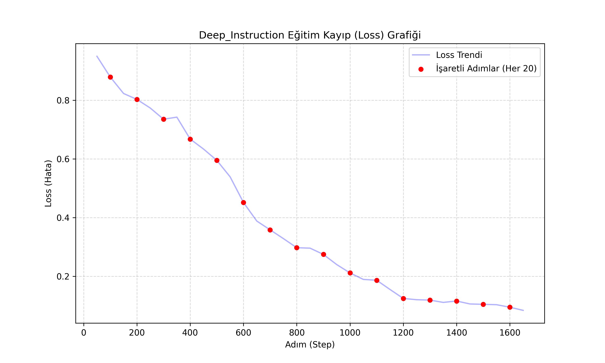
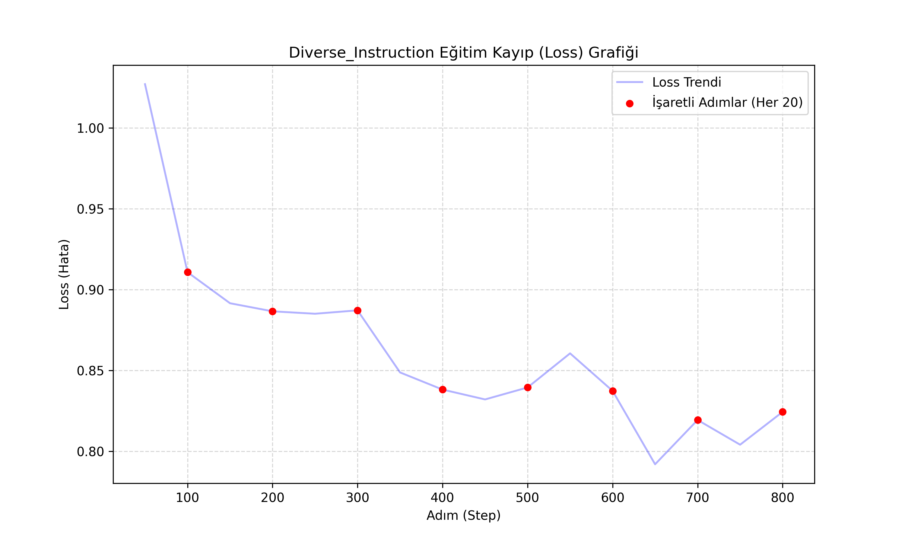

# 🧠 LLM Fine-Tuning ve Performans Analizi (Qwen2.5-Coder)

Bu proje, **Qwen2.5-Coder-1.5B-Instruct** Büyük Dil Modeli (LLM) üzerinde **LoRA (Low-Rank Adaptation)** tekniği kullanılarak yapılan ince ayar (fine-tuning) çalışmalarını ve performans analizlerini içerir.

Projenin temel amacı, **"Deep Instruction"** (Algoritmik/Mantıksal) ve **"Diverse Instruction"** (Genel/Çeşitli) veri setlerinin, modelin kodlama yeteneği üzerindeki etkisini karşılaştırmalı olarak incelemektir.

## 📂 Proje İçeriği

- **`train.py`**: Modeli eğitmek için kullanılan ana script. QLoRA, Peft ve TRL kütüphanelerini kullanır.
- **`CodeGen/`**: LiveCodeBench ve AtCoder testlerini çalıştırmak için kullanılan değerlendirme araçları.
- **`cizdir.py`**: Eğitim loglarını (trainer_state.json) okuyup Loss grafiklerini çizen araç.
- **`results/`**: Eğitim ve test sonuçlarının bulunduğu klasör.

## 🎯 Veri Setleri ve Yöntem

Model iki farklı yaklaşım ile eğitilmiştir:
1.  **Deep Instruction:** Karmaşık algoritmik problemler ve adım adım çözüm mantığı içeren veri seti.
2.  **Diverse Instruction:** Web geliştirme, veri analizi ve script yazımı gibi çeşitli konulardan oluşan veri seti.

**Eğitim Parametreleri:**
- **Model:** Qwen/Qwen2.5-Coder-1.5B-Instruct
- **Teknik:** LoRA (r=16, lora_alpha=32)
- **Epoch:** 2-4 Epoch
- **Precision:** bfloat16 (Flash Attention 2 destekli)

## 📊 Benchmark Sonuçları (LiveCodeBench - AtCoder Easy)

Eğitilen modeller, **AtCoder** platformunun "Easy" zorluk seviyesindeki 41 algoritma sorusu ile test edilmiştir.

| Model | En İyi Checkpoint | Çözülen Soru | Pass@1 Başarısı |
| :--- | :--- | :---: | :---: |
| **Deep Instruction** | Step 400 | **16 / 41** | **%39.0** 🏆 |
| **Diverse Instruction** | Step 800 | 11 / 41 | %26.8 |

> **Analiz:** Deep Instruction veri seti, algoritmik mantığa odaklandığı için benchmark testlerinde %39.0 başarı oranı ile Diverse modele göre belirgin bir üstünlük sağlamıştır.

## 📈 Eğitim Grafikleri

### Deep Instruction Loss Grafiği


### Diverse Instruction Loss Grafiği


## 🚀 Kurulum ve Kullanım

Projeyi kendi bilgisayarınızda çalıştırmak için:

1. **Gerekli kütüphaneleri yükleyin:**
   ```bash
   pip install torch transformers peft datasets trl bitsandbytes
   ```
   Eğitimi Başlatmak İçin:
 ```bash

  python train.py --model_name "Qwen/Qwen2.5-Coder-1.5B-Instruct" --dataset_name "deep"
```
   Benchmark Testi İçin:
```bash
  python CodeGen/livecodebench_eval.py --model_type deep_instruction --platform atcoder --difficulty easy
```
